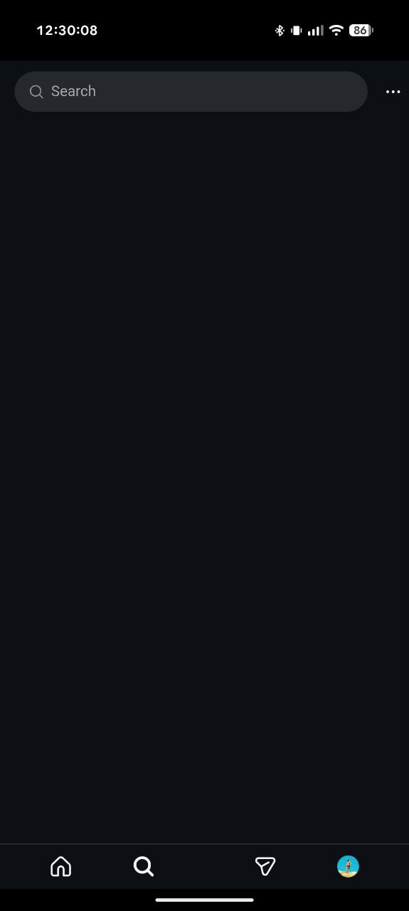

# JustAgram

**Instagram, but *just a gram* at a time.**

JustAgram is a distraction-free wrapper for Instagram designed to kill the doomscroll. It hides Reels, the Explore page, Stories, and the Home feed, leaving you with just your DMs, your profile, and the ability to post.

Why "JustAgram"? Because you should ideally use it *just a gram* at a time, not kilos of brainrot content per hour. 😉

## 📸 Screenshots
<p align="center">
  
  
</p>

## 📥 Installation
### Android:
[**Download the latest APK from Releases**](../../releases) or build it yourself using the instructions below.
### iOS:
currently you can only build it yourself using the instructions below.

---

## 🛠 How It Works
This application is a **CapacitorJS** container that loads the mobile Instagram website via `cordova-plugin-inappbrowser`.
It injects a custom CSS stylesheet that visually hides specific UI elements (like the feed container `main div` and navigation tabs) without modifying the underlying Instagram API. This ensures a fast, cross-platform experience while respecting Instagram's security policies (CSP).

## 💻 Development
Built with **Bun** and **Vanilla JS**.

### Prerequisites
- npm or [Bun](https://bun.sh/) for package management
- Node.js (for Capacitor CLI)
- Android Studio (for Android development)
- Xcode (for iOS development)

### Commands
```bash
# Install dependencies
bun install

# Sync web assets to native projects
bun run sync

# Run on Android emulator/device
bunx cap run android

#Open native project in IDE
bunx cap open android
bunx cap open ios
```

### Folder Structure
- [`www/`](www/): Web assets (HTML, CSS, JS)
- [`android/`](android/): Android native project (generated by Capacitor)
- [`ios/`](ios/): iOS native project (generated by Capacitor)
