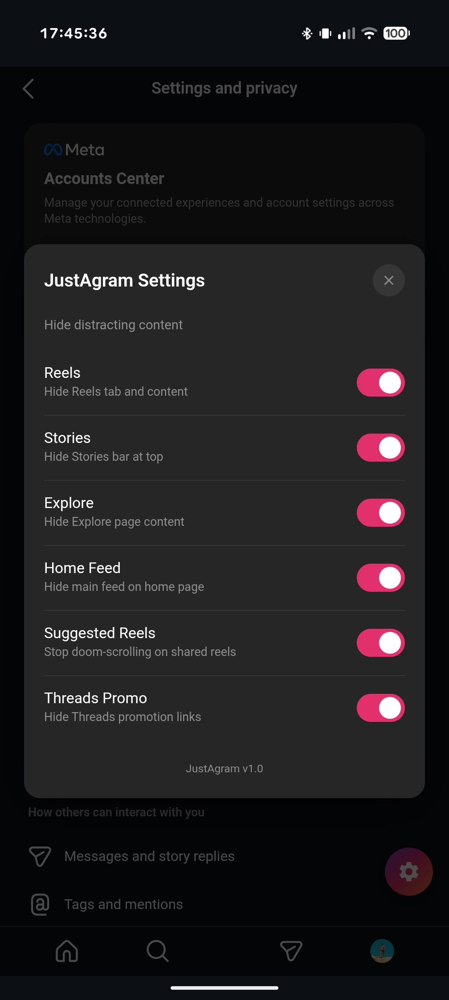

# JustAgram

**Instagram, but *just a gram* at a time.**

JustAgram is a distraction-free wrapper for Instagram designed to kill the doomscroll. It allows you to toggle exactly what you want to see—hiding Reels, the Explore page, Stories, and the Home feed, or keeping what you need.

Why "JustAgram"? Because you should ideally use it *just a gram* at a time, not kilos of brainrot content per hour. 😉

## 📸 Screenshots
<p align="center">
  
  
  
</p>

## ✨ Features
- **Toggleable Filters:** Choose what to hide: Reels, Stories, Explore, Feed, Suggested Reels, or Threads.
- **Floating Settings:** Access preferences directly within the app via a floating menu button.
- **Persistent Settings:** Your preferences are saved automatically using `localStorage`.
- **Modular Design:** Modular CSS rules for easy maintenance and updates.

## 📥 Installation
If you find this useful, click ⭐ in the top-right of the page to support the project.

[](https://github.com/AlexMatter1512/justagram)
### Android:
[**Download the latest APK from Releases**](../../releases) or build it yourself using the instructions below.
### iOS:
Currently you can only build it yourself using the instructions below.

---

## 🛠 How It Works
This application is a **CapacitorJS** container that loads the mobile Instagram website via [my fork of `cordova-plugin-inappbrowser`](https://github.com/AlexMatter1512/cordova-plugin-inappbrowser) that enables script injection.

It uses **Bun** to bundle TypeScript sources into the final web assets:
1.  **Main App:** `src/app/main.ts` manages the Capacitor app lifecycle and persistent settings.
2.  **Injected Script:** `src/injected/ts/addmenu.ts` is bundled and injected into the Instagram webview to render the UI and communicate with the main app.
3.  **Modular CSS:** Individual filter rules are loaded dynamically based on user settings.

## 💻 Development
Built with **Bun** and **TypeScript**.

### Prerequisites
- [Bun](https://bun.sh/) (Runtime & Bundler)
- Android Studio (for Android development)
- Xcode (for iOS development)

### Commands
```bash
# Install dependencies
bun install

# Build TypeScript sources
bun run build:ts

# Build and copy all assets (HTML/CSS/JS) to www/
bun run build

# Sync web assets to native projects
bun run sync

# Open native project in IDE
bun run open:android
bun run open:ios
```

### Folder Structure
- [`src/`](src/): TypeScript source code
    - [`app/`](src/app/): Main application logic (`main.ts`) and styles.
    - [`injected/`](src/injected/): Code injected into Instagram.
        - [`ts/`](src/injected/ts/): TypeScript logic (`addmenu.ts`) for the settings menu.
        - [`css/rules/`](src/injected/css/rules/): Individual CSS filter rules.
        - [`html/`](src/injected/html/): HTML templates.
    - [`types/`](src/types/): Shared TypeScript definitions.
- [`www/`](www/): Compiled output (do not edit directly).
- [`android/`](android/): Android native project.
- [`ios/`](ios/): iOS native project.
